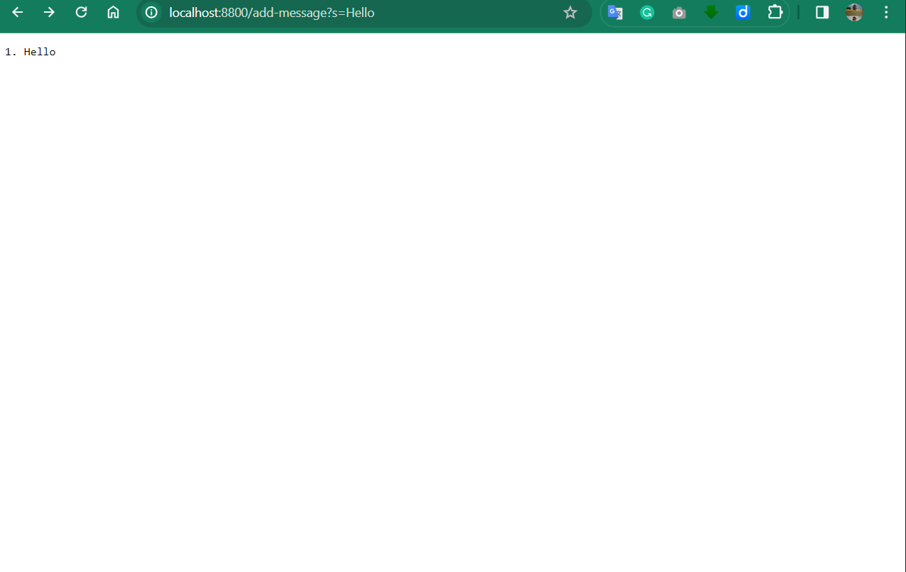
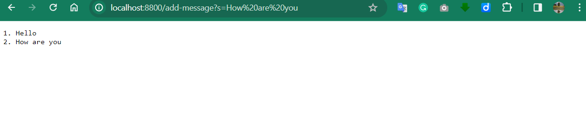

# Lab Report 2

```
class Handler implements URLHandler {
    List<String> messages = new ArrayList<>();

    public String handleRequest(URI url){
        if (url.getPath().contains("/add-message")){
            String[] parameters = url.getQuery().split("=");
            if (parameters[0].equals("s")){
                messages.add(parameters[1]);
                StringBuilder response = new StringBuilder();
                for(int i = 0; i < messages.size(); i++){
                    response.append(String.format("%d. %s\n", i+1 ,messages.get(i))); 
                }
                return response.toString();
            }
        }
        return "404 Not Found!";
    }
}
```


* The method name is called 
