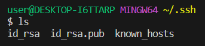

# Lab Report 2

```
class Handler implements URLHandler {
    List<String> messages = new ArrayList<>();

    public String handleRequest(URI url){
        if (url.getPath().contains("/add-message")){
            String[] parameters = url.getQuery().split("=");
            if (parameters[0].equals("s")){
                messages.add(parameters[1]);
                StringBuilder response = new StringBuilder();
                for(int i = 0; i < messages.size(); i++){
                    response.append(String.format("%d. %s\n", i+1 ,messages.get(i))); 
                }
                return response.toString();
            }
        }
        return "404 Not Found!";
    }
}
```

* Method: The methods in my code called handleRequest
* Relevant arguments: The URL contains the query parameter "?s=Hello"
* Relevant fields: 'messages' will contain a single string, "1. Hello"
* Changes in values: The 'messages' list will have "1. Hello" as its only element.

* Method: Handler.handleRequiest
* Relevant arguments: The URL contains the query parameter "?s=How are you."
* 'messages' will contain two strings, "1. hello" and "How are you"
* changes in values: the "messages" list will have "1. Hello\n2. How are you"as its content

  




I learned more commands: ssh, scp, mkdir throughout the week, they are very useful. I also learned how to log in to the remote server without the passcode, which saves a lot of time, but it was confusing while setting it up. Before the lab, I didn't know how to build a web page with Git Hub, how to use GitHub, and how to log in to a remote server.
